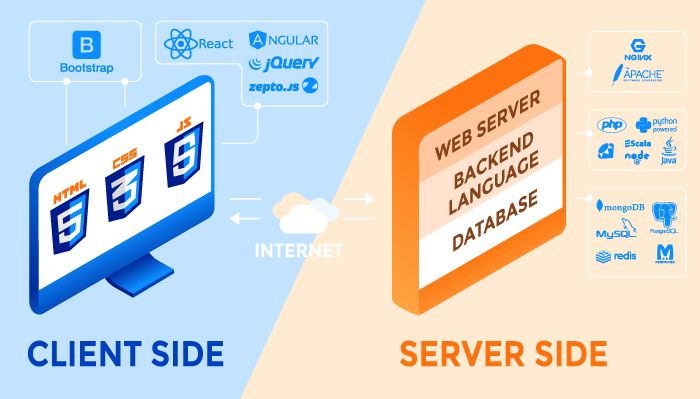
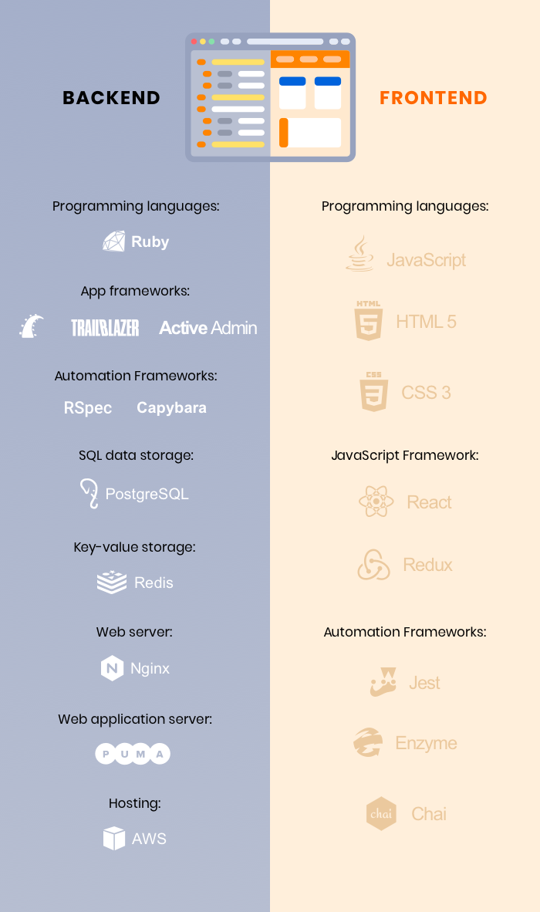
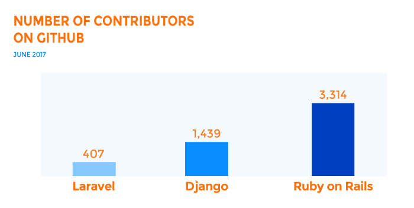
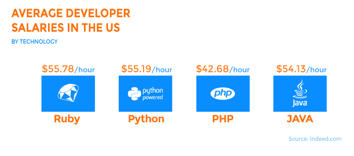

# Required Reading 7
## Smart Notes

# [Technology Stack for Web Application Development](https://rubygarage.org/blog/technology-stack-for-web-development) 

1. Picking the right **"Technology Stack"** one's app/web app will be based on.
    
2. **Technology Development Stack** comprises of 2 sides of web development, the client side (FrontEnd) and the server-side (involves an application, a BackEnd programming language that powers it, database, and server itself)
   
   #### Client-side Programming
        * HTML - tells browser how to display
        * CSS - styles the content being displayed
        * JavaScript - makes pages interactive
          -> JavaScript Libraries
                * jQuery
                * React.js
                * Zepto.js
          -> Frameworks
                * Angular
                * VUE
                * Backbone
                * Ember

    #### Server-side Programming (not visible to user's)
        * Powers client-side
        * Challenge of choosing server-side Tech for web app/apps
        * Used to create the logic of websites and applications
        * Frameworks offers tools for simpler and faster coding
  
          -> Popular Programming Languages and Major Frameworks
                * Ruby (Ruby on Rails)
                * Python (Django, Flask, Pylons)
                * PHP (Laravel)
                * Java (Spring)
                * Scala (Play)
                * Node.js, JavaScript runtime, also used for backend programming

        * Database - stores web apps/apps data - 2 Types
            * Relational
            * Non-Relational
  
         -> Common databases for web development
            * MySQL (relational)
            * PostgreSQL (relational)
            * MongoDB (non-relational, document)
  
        * Web application needs a caching system to reduce the load on the 
          database and to handle large amounts of traffic

         -> Widespread caching systems
            * Memcached
            * Redis

        * Server - handles client's request via computer (Client's computer)
  
         -> Major players in this domain
            * Apache
            * Nginx

##### Client Side vs Server Side

##### In short to develop web apps you must select a server, database, programming language, framework, and the frontend tools. These dev web tech build on top of each other and collectively are called a "Stack".

##### RubyGarage "Perfect technology stack for their projects"

 

#### How NOT to Choose a Web Technology Development Stack
##### Common practices one should avoid
    1. Do not choose based on your competitors
        * Your project is unique, ultimate goal! beat/outperform your competitor's
        * Tech stacks used by your competitors, might not be suitable for your project
        * Wrong choice leads to having to modernize your tech stack in the future - Not CHeap

    2. Do not choose based on personal prefence
        * you can rely on personal prefrences but comes with pitfalls, 
          must have solid background/full knowledge in web development
        * Not having have in-depth knowledge of the web development 
          process may/will lead to failure, and most likely choose the 
          wrong components for your tech staack

    3. Do not Choose Based on Previous Projects
        * No matter how succesfull previous projects were
        * Tech stack components could be outdated
        * Past project tech stacks might not be suitable for new porject

    4. Do not Choose Based on Online Research
        * The confusion of deciding which source is correct/believe
        * Picking relevant technologies will be very low, if based on 
          theoretical and online research

#### Criteria for Choosing a Tech Stack
##### Criteria you should consider, when trying to choose a "Tech Stack"
    1. Type of Web Application
        *  What are you planning to build 
        *  Pick tool set that provides unique advantages for task at hand
        *  Complexity

            -> Simple (created with out the box solutions, like CMS software; 
            Examples: Landing pages and simple online stores)

            -> Mid-level (aps with more functions are built with frameworks; 
            Examples: Large E-Commerce stores and Enterprises)

            -> Complex (lots of functions and integrations, developed with 
            different web development technologies and composed of several 
            programming languages; Examples: social networks, large ecommerce 
            marketplaces, fintech software, etc.)

        * Take business goals into account (very important)
        * Business goals impact choice of tech for development

            -> Processing heavy loads (web project which reliy on load processing
            choose programming languages and frameworks that can provide this.
            Examples of projects:  video/audio streaming apps and file sharing services)

            -> Low latency (utilizes different tech stacks to make web app highly responsive
            and reduce latency. Examples of projects: Social networks require low latency)

    2. Time to market (TTM) 
        * extremely important when choosing a tech stack for startups 
          and for small businesses.
        * Faster one develops and releases, will allow you to be ahead of competition  
        * Less time to develop the cheaper development costs
        * TTM heavily depends on the technology stack

            -> Out-of-the-box solutions (research this solution, for adding some 
            necessary functionality to your web application, Examples: Ruby on Rails Framework,
            allows developers to use open source libraries (called gems). To facilitate
            the dev process and reduce TTM)

            -> Integration with third-party solutions (verify tech stack one chooses
            supports integration with 3rd party solutions. It will add functions without 
            reinventing the wheel)

            -> Developer availability (find developers with expertise in the tech stack, 
            as building the web app is just the start, you will also need developers to 
            maintain after launch)

            -> Documentation and developer community (choose tech stack that has a large 
            community and rich documentation)

            -> Easy to test (removing all bugs requires a lot of time and slows down 
            development, choose technologies that are easy to test.Some technologies 
            are based on a so-called test-driven development approach, which implies 
            that testing goes first and coding comes after. Test-driven development 
            allows you to guarantee your code and product quality and speed up development 
            in the medium and long term)

    3. Web App Development Cost, web application are not free of charge
        * Developer salaries (highly skilled professionals whom are well-paid,
          Expenses will be different depending on tech stack, the more advanced 
          the technology is, the higher the developer salary will be.)

   

        * App maintenance cost (to reduce costs opt for free open-source tech)

   **Example:**
             
   [Ruby on Rails web development](https://rubygarage.org/services/ruby-on-rails-development)

    4. Security, Cyberattacks are the biggest threat to online businesses!
        * Pick the right technology to create a really secure app
        * No language guarantees 100% safety
        * Choose the right tool first and follow security guidelines second
        * Most web development technologies provide security guidelines... FOLLOW THEM!
        * Make sure your web app is created in accordance with the appropriate security guidelines

    5. Scalability -  isn’t a feature to turn your back on/do not ignore, there are 2 types
        * Horizontal scalability - means the ability to handle high traffic, growing number 
          of users if it grows dramatically
        * Vertical scalability - means the ability to add new components to a 
          web application without damaging its performance
  
        "Think of scalability in advance and choose an appropriate technology stack 
        for your or the clients needs"

# [Why Hasn’t Low-Code Revolutionized App Development Yet?](https://devetry.com/blog/why-hasnt-low-code-revolutionized-app-development-yet/)